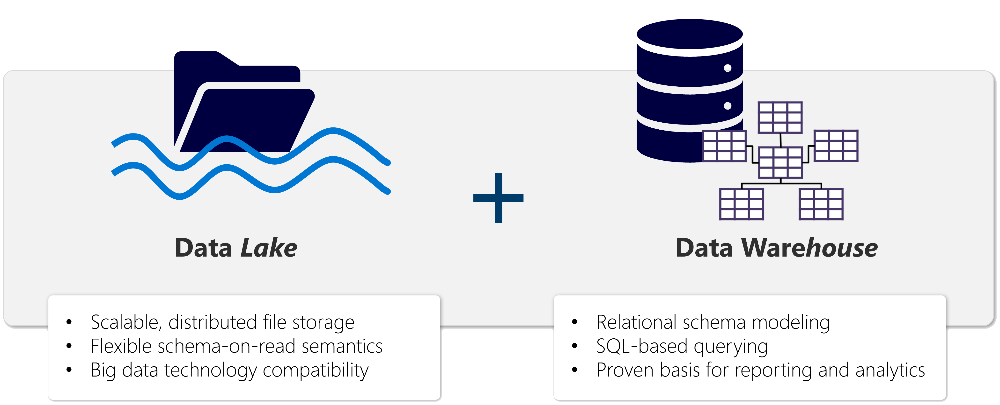
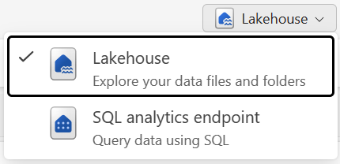

# Get started with lakehouses in Microsoft Fabric 

## Introduction

- The foundation of Microsoft Fabric is a **lakehouse**, which is built on top of the **OneLake** scalable storage layer and uses Apache Spark and SQL compute engines for big data processing. 

- A lakehouse is a unified platform that combines:
*-* The flexible and scalable storage of a data lake
*-* The ability to query and analyze data of a data warehouse

## Explore the Microsoft Fabric lakehouse

- A **lakehouse** presents as a database and is built on top of a data lake using Delta format tables. Lakehouses combine the SQL-based analytical capabilities of a relational data warehouse and the flexibility and scalability of a data lake. Lakehouses store all data formats and can be used with various analytics tools and programming languages. As cloud-based solutions, lakehouses can scale automatically and provide high availability and disaster recovery.

- 

- Some benefits of a lakehouse include:
*-* Lakehouses use Spark and SQL engines to process large-scale data and support machine learning or predictive modeling analytics.
*-* Lakehouse data is organized in a schema-on-read format, which means you define the schema as needed rather than having a predefined schema.
*-* Lakehouses support ACID (Atomicity, Consistency, Isolation, Durability) transactions through Delta Lake formatted tables for data consistency and integrity.
*-* Lakehouses are a single location for data engineers, data scientists, and data analysts to access and use data.

- **Load data into a lakehouse**

  - Fabric lakehouses are a central element for your analytics solution. You can follow the ETL (Extract, Transform, Load) process to ingest and transform data before loading to the lakehouse.

  - You can ingest data in many common formats from various sources, including local files, databases, or APIs. You can also create Fabric **shortcuts** to data in external sources, such as Azure Data Lake Store Gen2 or OneLake. Use the Lakehouse explorer to browse files, folders, shortcuts, and tables and view their contents within the Fabric platform.

- **Secure a lakehouse**

  - Lakehouse access is managed either through the workspace or item-level sharing. Workspaces roles should be used for collaborators because these roles grant access to all items within the workspace. Item-level sharing is best used for granting access for read-only needs, such as analytics or Power BI report development.

## Work with Microsoft Fabric lakehouses

- **Create and explore a lakehouse**

  - When you create a new lakehouse, you have three different data items automatically created in your workspace.
  *-* The **lakehouse** contains shortcuts, folders, files, and tables.
  *-* The **Semantic model (default)** provides an easy data source for Power BI report developers.
  *-* The **SQL analytics endpoint** allows read-only access to query data with SQL.

  - 

  - You can work with the data in the lakehouse in two modes:
  *-* **lakehouse** enables you to add and interact with tables, files, and folders in the lakehouse.
  *-* **SQL analytics** endpoint enables you to use SQL to query the tables in the lakehouse and manage its relational semantic model.
  - 
  
- **Ingest data into a lakehouse**

  - Ingesting data into your lakehouse is the first step in your ETL process. Use any of the following methods to bring data into your lakehouse.
  *-* **Upload**: Upload local files.
  *-* **Dataflows Gen2**: Import and transform data using Power Query.
  *-* **Notebooks**: Use Apache Spark to ingest, transform, and load data.
  *-* **Data Factory** pipelines: Use the Copy data activity.

  - **Spark job definitions** can also be used to submit batch/streaming jobs to Spark clusters. By uploading the binary files from the compilation output of different languages (for example, .jar from Java), you can apply different transformation logic to the data hosted on a lakehouse.

- **Access data using shortcuts**

  - Another way to access and use data in Fabric is to use shortcuts. Shortcuts enable you to integrate data into your lakehouse while keeping it stored in external storage.

  - Shortcuts are useful when you need to source data that's in a different storage account or even a different cloud provider. Within your lakehouse you can create shortcuts that point to different storage accounts and other Fabric items like data warehouses, KQL databases, and other lakehouses.

## Explore and transform data in a lakehouse

- **Transform and load data**

  - Most data requires transformations before loading into tables. You might ingest raw data directly into a lakehouse and then further transform and load into tables. Regardless of your ETL design, you can transform and load data simply using the same tools to ingest data. Transformed data can then be loaded as a file or a Delta table.

  - *-* Notebooks are favored by data engineers familiar with different programming languages including PySpark, SQL, and Scala.
  *-* Dataflows Gen2 are excellent for developers familiar with Power BI or Excel since they use the PowerQuery interface.
  *-* Pipelines provide a visual interface to perform and orchestrate ETL processes. Pipelines can be as simple or as complex as you need.

- **Analyze and visualize data in a lakehouse**

  - After data is ingested, transformed, and loaded, it's ready for others to use. Fabric items provide the flexibility needed for every organization so you can use the tools that work for you.

  - *-* Data scientists can use notebooks or Data wrangler to explore and train machine learning models for AI.
  *-* Report developers can use the semantic model to create Power BI reports.
  *-* Analysts can use the SQL analytics endpoint to query, filter, aggregate, and otherwise explore data in lakehouse tables.

