# Use Apache Spark in Microsoft Fabric

## Introduction

- Apache Spark is an open source parallel processing framework for large-scale data processing and analytics. Spark has become popular in "big data" processing scenarios, and is available in multiple platform implementations; including Azure HDInsight, Azure Synapse Analytics, and Microsoft Fabric.

## Prepare to use Apache Spark

- Apache Spark is a distributed data processing framework that enables large-scale data analytics by coordinating work across multiple processing nodes in a cluster, known in Microsoft Fabric as a Spark pool. Put more simply, Spark uses a "divide and conquer" approach to processing large volumes of data quickly by distributing the work across multiple computers. The process of distributing tasks and collating results is handled for you by Spark.

- **Spark pools**
  
  - 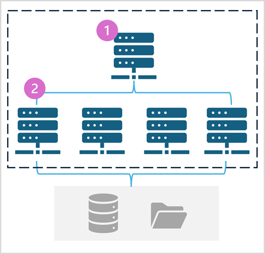

  - A Spark pool consists of compute nodes that distribute data processing tasks. The general architecture is shown in the following diagram.

  - As shown in the diagram, a Spark pool contains two kinds of node:
    1 *.* A head node in a Spark pool coordinates distributed processes through a driver program.
    2 *.* The pool includes multiple worker nodes on which executor processes perform the actual data processing tasks.

  - **Spark pools in Microsoft Fabric**

    - Microsoft Fabric provides a starter pool in each workspace, enabling Spark jobs to be started and run quickly with minimal setup and configuration. You can configure the starter pool to optimize the nodes it contains in accordance with your specific workload needs or cost constraints.

    - 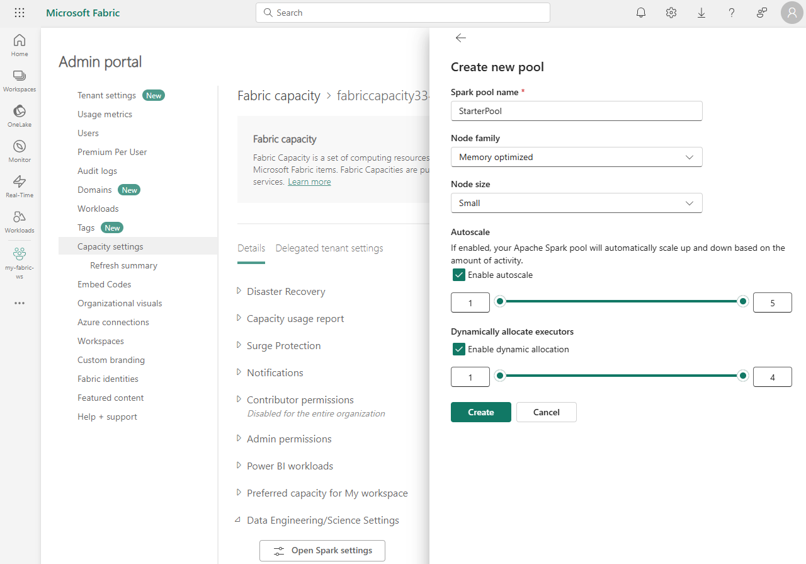
    You can manage settings for the starter pool and create new Spark pools in the **Admin portal** section of the workspace settings, under **Capacity settings**, then **Data Engineering/Science Settings**.

    - Specific configuration settings for Spark pools include:
    *-* **Node Family**: The type of virtual machines used for the Spark cluster nodes. In most cases, memory optimized nodes provide optimal performance.
    *-* **Autoscale**: Whether or not to automatically provision nodes as needed, and if so, the initial and maximum number of nodes to be allocated to the pool.
    *-* **Dynamic allocation**: Whether or not to dynamically allocate executor processes on the worker nodes based on data volumes.

- **Runtimes and environments**

  - The Spark open source ecosystem includes multiple versions of the Spark runtime, which determines the version of Apache Spark, Delta Lake, Python, and other core software components that are installed. Additionally, within a runtime you can install and use a wide selection of code libraries for common (and sometimes very specialized) tasks. In some cases, organizations may need to define multiple environments to support a diverse range of data processing tasks.

  - **Spark runtimes in Microsoft Fabric**
    
    - Microsoft Fabric supports multiple Spark runtimes, and will continue to add support for new runtimes as they are released. You can use the workspace settings interface to specify the Spark runtime that is used by default environment when a Spark pool is started.

  - **Environments in Microsoft Fabric**
    
    - 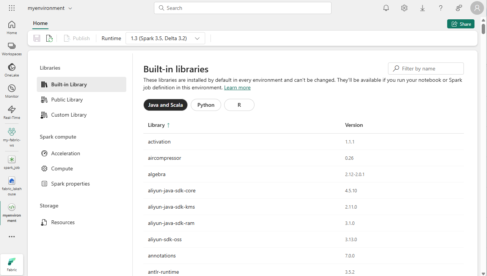
    You can create custom environments in a Fabric workspace, enabling you to use specific Spark runtimes, libraries, and configuration settings for different data processing operations.
  
    - When creating an environment, you can:
    *-* Specify the Spark runtime it should use.
    *-* View the built-in libraries that are installed in every environment.
    *-* Install specific public libraries from the Python Package Index (PyPI).
    *-* Install custom libraries by uploading a package file.
    *-* Specify the Spark pool that the environment should use.
    *-* Specify Spark configuration properties to override default behavior.
    *-* Upload resource files that need to be available in the environment.

- **Additional Spark configuration options**

  - **Native execution engine**

    - The native execution engine in Microsoft Fabric is a vectorized processing engine that runs Spark operations directly on lakehouse infrastructure. Using the native execution engine can significantly improve the performance of queries when working with large data sets in Parquet or Delta file formats.
    
    - To enable the native execution engine for a specific script or notebook, you can set these configuration properties at the beginning of your code, like this:
    ```
    %%configure 
    { 
      "conf": {
          "spark.native.enabled": "true", 
          "spark.shuffle.manager": "org.apache.spark.shuffle.sort.ColumnarShuffleManager" 
      } 
    }
    ```

  - **High concurrency mode**
    
    - When you run Spark code in Microsoft Fabric, a Spark session is initiated. You can optimize the efficiency of Spark resource usage by using high concurrency mode to share Spark sessions across multiple concurrent users or processes.
    
    - You can also enable high concurrency mode for Spark jobs, enabling similar efficiencies for concurrent non-interactive Spark script execution.
    
    - To enable high concurrency mode, use the **Data Engineering/Science** section of the workspace settings interface.

  - **Automatic MLFlow logging**
    
    - MLFlow is an open source library that is used in data science workloads to manage machine learning training and model deployment. A key capability of MLFlow is the ability to log model training and management operations. By default, Microsoft Fabric uses MLFlow to implicitly log machine learning experiment activity without requiring the data scientist to include explicit code to do so. You can disable this functionality in the workspace settings.

  - **Spark administration for a Fabric capacity**
  
    - Administrators can manage Spark settings at a Fabric capacity level, enabling them to restrict and override Spark settings in workspaces within an organization.

## Run Spark code

- **Notebooks**
  
  - 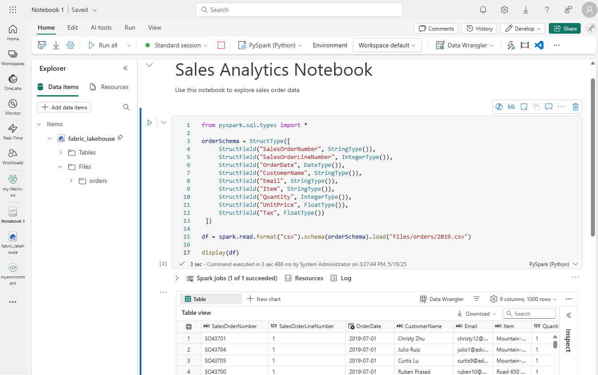
  When you want to use Spark to explore and analyze data interactively, use a notebook. Notebooks enable you to combine text, images, and code written in multiple languages to create an interactive item that you can share with others and collaborate.

- **Spark job definition**
  
  - 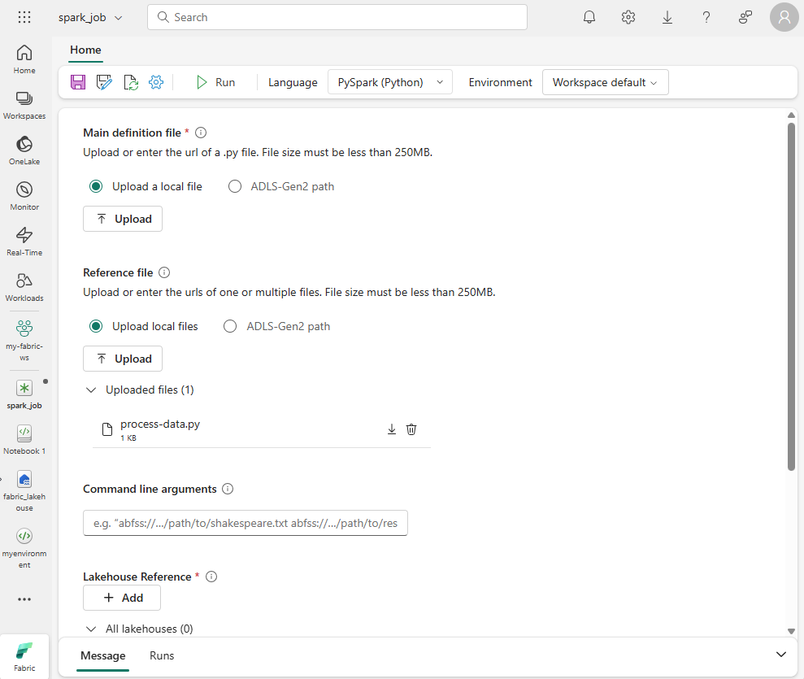
  If you want to use Spark to ingest and transform data as part of an automated process, you can define a Spark job to run a script on-demand or based on a schedule. To configure a Spark job, create a Spark Job Definition in your workspace and specify the script it should run.

- **Work with data in a Spark dataframe**

  - Natively, Spark uses a data structure called a resilient distributed dataset (RDD); but while you can write code that works directly with RDDs, the most commonly used data structure for working with structured data in Spark is the dataframe, which is provided as part of the Spark SQL library.

### Loading data into a dataframe
Let's explore a hypothetical example to see how you can use a dataframe to work with data. Suppose you have the following data in a comma-delimited text file named products.csv in the Files/data folder in your lakehouse:
```
ProductID,ProductName,Category,ListPrice
771,"Mountain-100 Silver, 38",Mountain Bikes,3399.9900
772,"Mountain-100 Silver, 42",Mountain Bikes,3399.9900
773,"Mountain-100 Silver, 44",Mountain Bikes,3399.9900
...
```

- **Inferring a schema**
  - 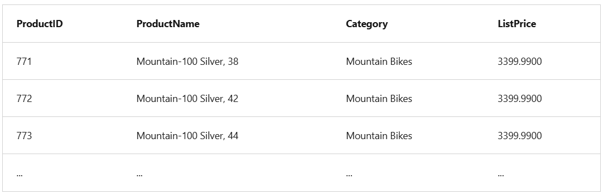
  The %%pyspark line at the beginning is called a magic, and tells Spark that the language used in this cell is PySpark. You can select the language you want to use as a default in the toolbar of the Notebook interface, and then use a magic to override that choice for a specific cell.
  ```
  %%pyspark
  df = spark.read.load('Files/data/products.csv',
      format='csv',
      header=True
  )
  display(df.limit(10))
  ```

- **Specifying an explicit schema**
  - 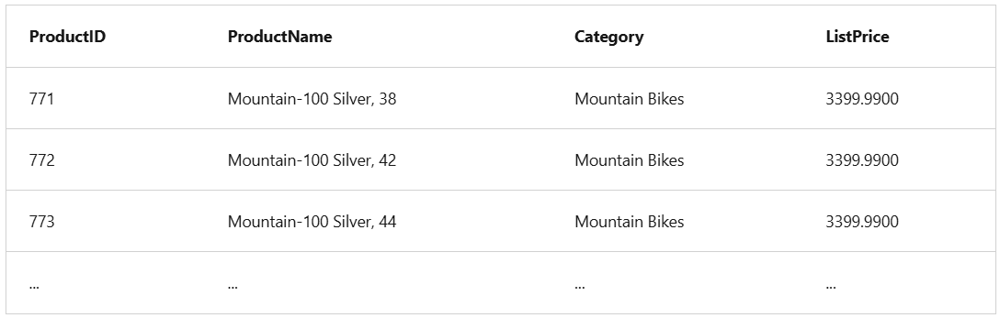
  You can also specify an explicit schema for the data, which is useful when the column names aren't included in the data file, like this CSV example:
  ```
  771,"Mountain-100 Silver, 38",Mountain Bikes,3399.9900
  772,"Mountain-100 Silver, 42",Mountain Bikes,3399.9900
  773,"Mountain-100 Silver, 44",Mountain Bikes,3399.9900
  ...
  ```
  The following PySpark example shows how to specify a schema for the dataframe to be loaded from a file named product-data.csv in this format:
  ```
  from pyspark.sql.types import *
  from pyspark.sql.functions import *

  productSchema = StructType([
      StructField("ProductID", IntegerType()),
      StructField("ProductName", StringType()),
      StructField("Category", StringType()),
      StructField("ListPrice", FloatType())
      ])

  df = spark.read.load('Files/data/product-data.csv',
      format='csv',
      schema=productSchema,
      header=False)
  display(df.limit(10))
  ```    

### Filtering and grouping dataframes

- 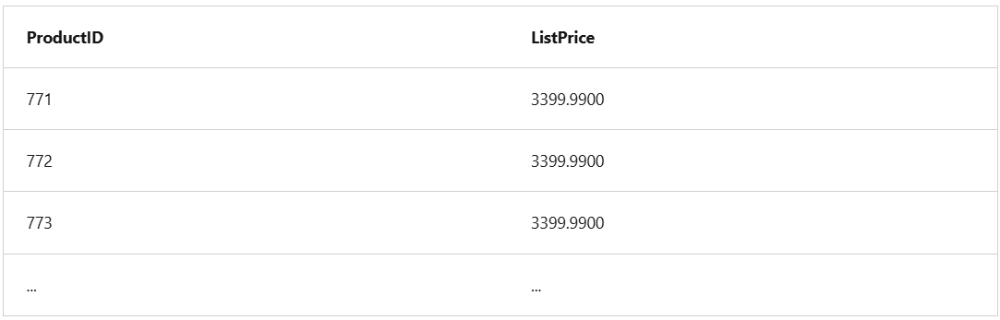
You can use the methods of the Dataframe class to filter, sort, group, and otherwise manipulate the data it contains. For example, the following code example uses the select method to retrieve the ProductID and ListPrice columns from the df dataframe containing product data in the previous example:
```    
pricelist_df = df.select("ProductID", "ListPrice")
```    
- 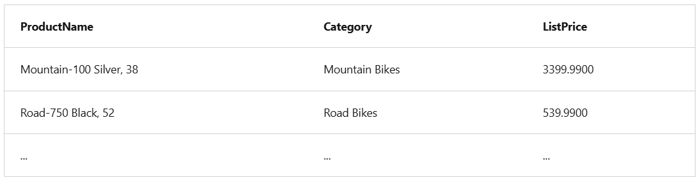
You can "chain" methods together to perform a series of manipulations that results in a transformed dataframe. For example, this example code chains the select and where methods to create a new dataframe containing the ProductName and ListPrice columns for products with a category of Mountain Bikes or Road Bikes:
```    
bikes_df = df.select("ProductName", "Category", "ListPrice").where((df["Category"]=="Mountain Bikes") | (df["Category"]=="Road Bikes"))
display(bikes_df)
```    
- 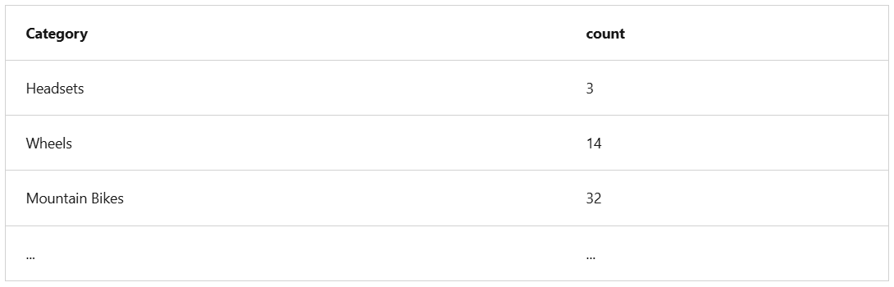
To group and aggregate data, you can use the groupBy method and aggregate functions. For example, the following PySpark code counts the number of products for each category:
```    
counts_df = df.select("ProductID", "Category").groupBy("Category").count()
display(counts_df)
```    

### Saving a dataframe
- You'll often want to use Spark to transform raw data and save the results for further analysis or downstream processing. The following code example saves the dataFrame into a parquet file in the data lake, replacing any existing file of the same name.
```    
bikes_df.write.mode("overwrite").parquet('Files/product_data/bikes.parquet')
```    

- **Partitioning the output file**
  - To save a dataframe as a partitioned set of files, use the partitionBy method when writing the data. The following example saves the bikes_df dataframe (which contains the product data for the mountain bikes and road bikes categories), and partitions the data by category:
  ```      
  bikes_df.write.partitionBy("Category").mode("overwrite").parquet("Files/bike_data")
  ```      
  - The folder names generated when partitioning a dataframe include the partitioning column name and value in a column=value format, so the code example creates a folder named bike_data that contains the following subfolders:
    * Category=Mountain Bikes
    * Category=Road Bikes
  Each subfolder contains one or more parquet files with the product data for the appropriate category.

### Load partitioned data
  - When reading partitioned data into a dataframe, you can load data from any folder within the hierarchy by specifying explicit values or wildcards for the partitioned fields. The following example loads data for products in the Road Bikes category:
  ```      
  road_bikes_df = spark.read.parquet('Files/bike_data/Category=Road Bikes')
  display(road_bikes_df.limit(5))  
  ```          
## Work with data using Spark SQL
The Dataframe API is part of a Spark library named Spark SQL, which enables data analysts to use SQL expressions to query and manipulate data.
---

### Creating database objects in the Spark catalog
- The Spark catalog is a metastore for relational data objects such as views and tables.
- One of the simplest ways to make data in a dataframe available for querying in the Spark catalog is to create a temporary view, as shown in the following code example:
```          
df.createOrReplaceTempView("products_view")
```            
- You can also create tables that are persisted in the catalog to define a database that can be queried using Spark SQL.
- In Microsoft Fabric, data for managed tables is stored in the Tables storage location shown in your data lake, and any tables created using Spark are listed there.
- You can create an empty table by using the spark.catalog.createTable method, or you can save a dataframe as a table by using its saveAsTable method. Deleting a managed table also deletes its underlying data.
For example, the following code saves a dataframe as a new table named products:
```          
df.write.format("delta").saveAsTable("products")
```          
- Additionally, you can create external tables by using the spark.catalog.createExternalTable method. External tables define metadata in the catalog but get their underlying data from an external storage location; typically a folder in the Files storage area of a lakehouse. Deleting an external table doesn't delete the underlying data.

### Using the Spark SQL API to query data
- 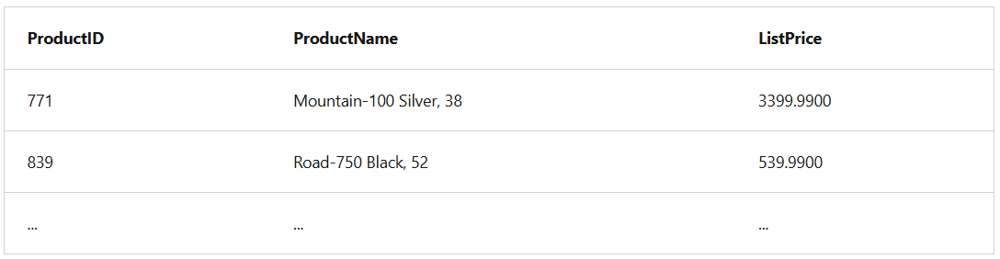
You can use the Spark SQL API in code written in any language to query data in the catalog. For example, the following PySpark code uses a SQL query to return data from the products table as a dataframe.
```          
bikes_df = spark.sql("SELECT ProductID, ProductName, ListPrice \
                      FROM products \
                      WHERE Category IN ('Mountain Bikes', 'Road Bikes')")
display(bikes_df)
```          

- **Using SQL code**
- 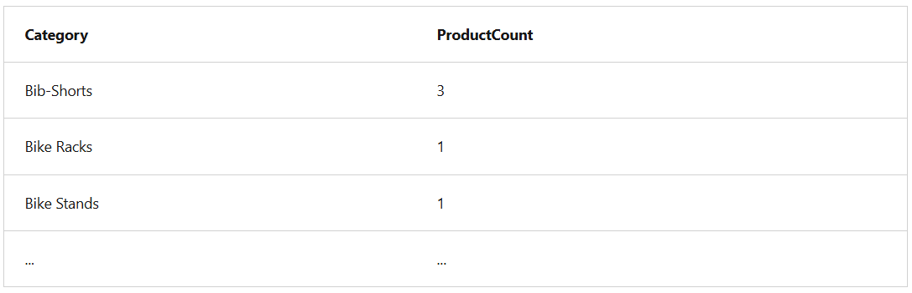
The previous example demonstrated how to use the Spark SQL API to embed SQL expressions in Spark code. In a notebook, you can also use the %%sql magic to run SQL code that queries objects in the catalog, like this:
```          
%%sql

SELECT Category, COUNT(ProductID) AS ProductCount
FROM products
GROUP BY Category
ORDER BY Category
```          

## Visualize data in a Spark notebook
Notebooks in Microsoft Fabric provide some basic charting capabilities in the user interface, and when that functionality doesn't provide what you need, you can use one of the many Python graphics libraries to create and display data visualizations in the notebook.
---

### Using built-in notebook charts
- 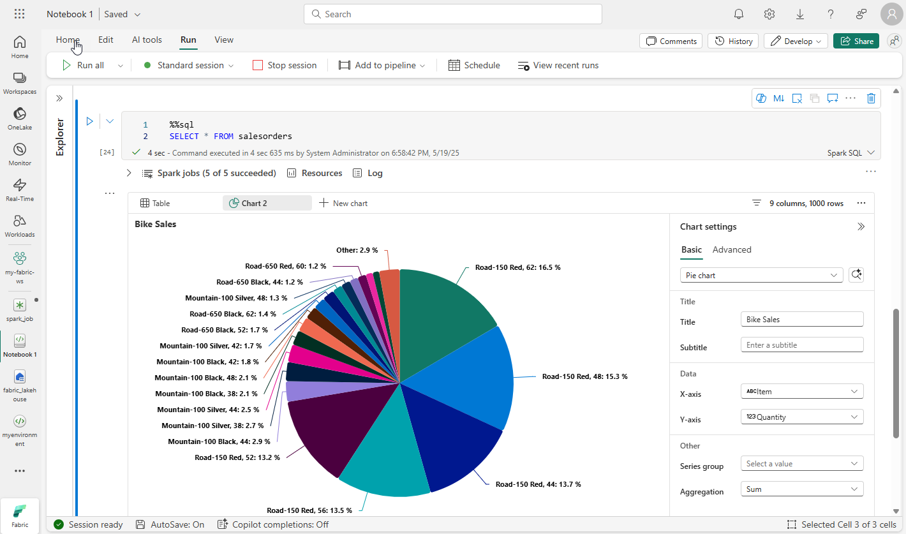
When you display a dataframe or run a SQL query in a Spark notebook, the results are displayed under the code cell. By default, results are rendered as a table, but you can also change the results view to a chart and use the chart properties to customize how the chart visualizes the data, as shown here:

### Using graphics packages in code
- In particular, Python supports a large selection of packages; most of them built on the base Matplotlib library.
- For example, you could use the following PySpark code to aggregate data from the hypothetical products data explored previously in this module, and use Matplotlib to create a chart from the aggregated data.
```          
from matplotlib import pyplot as plt

# Get the data as a Pandas dataframe
data = spark.sql("SELECT Category, COUNT(ProductID) AS ProductCount \
                  FROM products \
                  GROUP BY Category \
                  ORDER BY Category").toPandas()

# Clear the plot area
plt.clf()

# Create a Figure
fig = plt.figure(figsize=(12,8))

# Create a bar plot of product counts by category
plt.bar(x=data['Category'], height=data['ProductCount'], color='orange')

# Customize the chart
plt.title('Product Counts by Category')
plt.xlabel('Category')
plt.ylabel('Products')
plt.grid(color='#95a5a6', linestyle='--', linewidth=2, axis='y', alpha=0.7)
plt.xticks(rotation=70)

# Show the plot area
plt.show()
```          
- 
The Matplotlib library requires data to be in a Pandas dataframe rather than a Spark dataframe, so the toPandas method is used to convert it.
- You can use the Matplotlib library to create many kinds of chart; or if preferred, you can use other libraries such as Seaborn to create highly customized charts.

